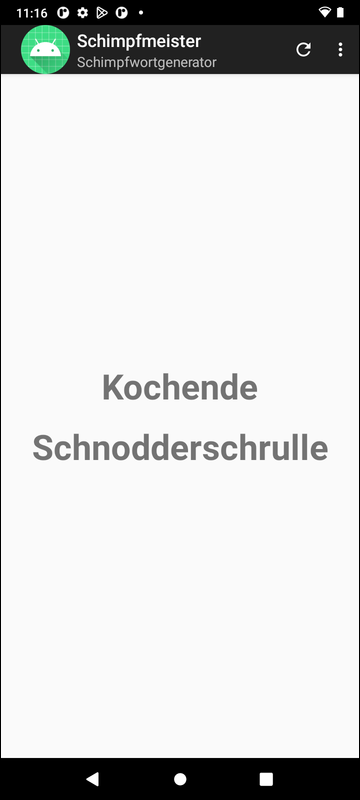

# Schimpfmeister (Variante für App-Store) #

 

Das Repo enhält ein Projekt für *Android Studio* für eine native Android-App (Java).
Die App erzeugt zufällige Schimpfwörter unter Verwendung der Wortlisten und des Algorithmus von
[Schimpfolino](https://github.com/NikolaiRadke/Schimpfolino/) von Nikolai Radke.

 

URL der App im App-Store "Google Play": https://play.google.com/store/apps/details?id=de.mide.android.schimpfmeister

 

Endnutzerdokumentation: siehe [Wiki von diesem Repo](https://github.com/MDecker-MobileComputing/Android_Schimpfmeister_AppStore/wiki)

 

----

## Screenshots ##

 

 &nbsp; 

 

----

## License ##

 

See the [LICENSE file](LICENSE.md) for license rights and limitations (BSD 3-Clause License).

 
